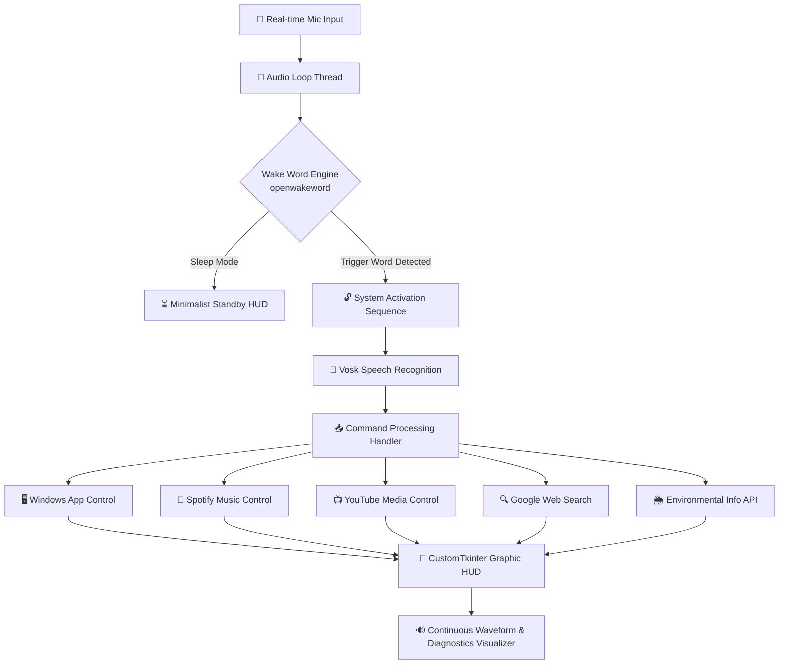

# 🎙️ My.Jarvis Voice Assistant

<p align="center">
  <a href="https://www.python.org">
    
  </a>
  
  
</p>

<p align="center">
  <a href="https://alphacephei.com/vosk/">
    
  </a>
  <a href="https://github.com/dscripka/openwakeword">
    
  </a>
  <a href="https://github.com/TomSchimansky/CustomTkinter">
    
  </a>
</p>

---

## 🌌 Overview

**My.Jarvis** (Just A Rather Very Intelligent System) is a state-of-the-art, desktop-based virtual voice assistant inspired by futuristic sci-fi holographic interfaces. 

Featuring an **Unreal Engine-inspired premium visual interface**, My.Jarvis operates **100% offline** for its core speech processing, using deep learning wake-word classification and acoustic speech-to-text modeling.



---

## 📥 Direct Download (Windows Executable)

If you want to run My.Jarvis on your PC instantly without installing Python, cloning the code, or managing dependencies, you can download the pre-compiled standalone executable:

<p align="center">
  <a href="https://github.com/engineer948/My.Jarvis/releases/download/Alpha/My.Jarvis.exe">
    
  </a>
</p>

> [!WARNING]
> **Security Notice & False Positives:**
> - **VirusTotal Detection:** For unknown reasons, the compiled standalone executable triggers false-positive virus detections on VirusTotal. You can view the scan report here: [VirusTotal Scan Report for My.Jarvis.exe](https://www.virustotal.com/gui/file/db3efd2ffd0c509189d5fb091da6711355a330956ba03cc2effee5566c97e69b).
> - **Windows SmartScreen Warning:** Since the executable does not have a paid digital code-signing certificate, Windows SmartScreen will block it from running by default. We plan to resolve this in future releases.
> - **Alternative (Run from Source):** If you do not trust the pre-built binary, you can run the application directly from source code using Python (highly recommended for complete transparency). You can view the scan report for the Python source archive here: [VirusTotal Scan Report for Source Code](https://www.virustotal.com/gui/file/0d000541bdca350b1f28f3de711cfa73d4d54aae126ce639f0af6338a15d0165?nocache=1). Please follow the instructions in the [Run From Source (Developer Setup)](#a-run-from-source-developer-setup) section to run `ui.py` yourself.

---

## ✨ Premium Features

* **💎 Holographic UI Interface**: Built with modern CustomTkinter, styled with harmonized dark cyan/blue glow aesthetics, floating module panels, and geometric scanlines mimicking a high-fidelity cinematic display.
* **🐕 Deep Learning Wake-word Detection**: Driven by `openwakeword`, My.Jarvis listens continuously in a lightweight thread, activating immediately when you say *"Hey Jarvis"*.
* **🎙️ Completely Offline Speech-to-Text**: Employs a pre-packaged 70MB **Vosk acoustic speech model**, enabling rapid voice transcription and action execution with zero latency—**no internet connection required**.
* **📊 Live Audio Visualizer**: A continuous, fluid wave visualization of the user's live microphone input levels using advanced `audioop` RMS math and canvas smooth rendering.
* **🌐 Dynamic Environmental Telemetry**: Periodically syncs with weather servers via background worker threads to show real-time weather, date, time, and system statuses in beautiful corner widget frames.

---

## 🗣️ Supported Commands

My.Jarvis utilizes a clean and explicit command architecture to process your voice requests seamlessly and eliminate triggers collision.

### 🖥️ Windows Application Controls ([app_control.py](https://github.com/engineer948/My.Jarvis/blob/main/app_control.py))
* **Commands**: `open [app]`, `run [app]`, `start [app]`, `launch [app]`
* **How it works**: Automatically scans the Windows Start Menu (both User and System directories) to find matching application shortcuts (`.lnk` or `.url`). If no match is found, it attempts to execute the command directly via the system fallback (e.g., `cmd` or `notepad`).
* **Intelligent App Mapping**:
  * `gta 5` / `gta v` ➔ Matches Grand Theft Auto V
  * `chrome` ➔ Matches Google Chrome / Chrome Browser
  * `firefox` ➔ Matches Mozilla Firefox
  * `word` ➔ Matches Microsoft Word
  * `excel` ➔ Matches Microsoft Excel
  * `powerpoint` ➔ Matches Microsoft Powerpoint
  * `cmd` ➔ Matches Command Prompt
  * `notepad` ➔ Matches Notepad / Notepad++
  * `steam` ➔ Matches Steam Client
  * `spotify` ➔ Matches Spotify Client

### 🎵 Spotify Music Controls ([spotify_control.py](https://github.com/engineer948/My.Jarvis/blob/main/spotify_control.py))
* **Song Search**: `play song [name]`, `play spotify [name]`, `spotify play [name]`, `[name] on spotify`
  * *Confirmation Required*: My.Jarvis will print/speak `"Spotify search: [song] - confirm? (yes/no)"`. You must say **"yes"** or **"no"** to execute or cancel.
* **Pause Music**: `stop music` (Pauses the active track globally via system media command).
* **Resume Music**: `play music` (Resumes playback via system media command).
* **Skip Track**: `next music` (Skips to the next track).
* **Previous Track**: `previous music` (Plays the previous track).

### 📺 YouTube Media Controls ([youtube_control.py](https://github.com/engineer948/My.Jarvis/blob/main/youtube_control.py))
* **YouTube Search**: `youtube search [query]`, `search youtube [query]`, `[query] on youtube`, `[query] youtube`
  * *Confirmation Required*: My.Jarvis will print/speak `"YouTube search: [query] - confirm? (yes/no)"`. You must say **"yes"** or **"no"** to search.
* **Pause/Play**: `play video` / `stop video` (Brings the YouTube browser window to focus and simulates pressing **'k'** to play/pause).
* **Skip Video**: `next video` (Brings the YouTube window to focus and simulates pressing **'Shift + N'**).
* **Previous Video**: `previous video` (Brings the YouTube window to focus and simulates pressing **'Shift + P'**).
* **Volume Up**: `adjust youtube volume` / `increase youtube volume` (Increases YouTube player volume by 10% using **'Up Arrow'** keys).
* **Volume Down**: `reduce youtube volume` / `decrease youtube volume` (Decreases YouTube player volume by 10% using **'Down Arrow'** keys).

### 🔍 Google Web Searches ([search.py](https://github.com/engineer948/My.Jarvis/blob/main/search.py))
* **Commands**: `search [query]`, `search for [query]`, `google search [query]`, `google [query]`, `look up [query]`, `find [query]`
  * *Confirmation Required*: My.Jarvis will print/speak `"Search: [query] - confirm? (yes/no)"`. You must say **"yes"** or **"no"** to perform a Google Search.

### 🌦️ Weather & System Telemetry ([info.py](https://github.com/engineer948/My.Jarvis/blob/main/info.py))
* **Time Check**: `what time is it`, `time` (Reports and speaks current local system time).
* **Date Check**: `what date is it`, `date`, `today` (Reports and speaks the current system date).
* **Offline Weather**: `weather`, `weather in [city]` (Defaults to Baku weather info if no city is specified).

### 🖱️ HUD Interactive UI Features
* **Central Hologram Ring**: Click the central visualizer in Standby Mode to trigger the **System Activation Sequence** manually.
* **🔴 Power Button (Top Right)**: Click to instantly turn off system modules and return the assistant to **Standby Mode**.
* **🎙️ Microphone Button (Top Right - Active Mode)**: Click to mute or unmute the system microphone. When muted, the button shows a crossed red icon and stops processing speech.
* **🔊 Speaker Button (Top Right - Active Mode)**: Click to toggle Text-to-Speech (TTS) vocal voice. When muted, My.Jarvis runs all commands but outputs results only in text, keeping the computer quiet.
* **⌨️ Command Input Box (Bottom Center - Active Mode)**: Press `Enter` in the console input box to manually type, execute, and debug commands directly.

---

## 📂 Repository File Structure

To keep the repository clean, lightweight, and professional, **only the source code, builder configuration, and core documents are pushed to the main branch**. All heavy builds (`build/`, `dist/` folders) and the pre-compiled local acoustic model (`model/` folder) should be excluded from Git commits.

### Pushed Files:
* `main.py` - Standard voice-based console listener entry point.
* `ui.py` - Core graphical user interface dashboard.
* `app_control.py` - Handler to launch Windows programs.
* `spotify_control.py` - Handler for Spotify music streaming and media controls.
* `youtube_control.py` - Handler for YouTube media, volume, and playback control.
* `search.py` - Handler for explicit Google web queries.
* `tts_control.py` - Text-to-Speech (TTS) controller.
* `info.py` - Weather and date telemetry handler.
* `wakeword.py` - Wake-word classification worker using openwakeword.
* `Jarvis.spec` - PyInstaller build specification.
* `build.bat` - Automative executable build script.
* `LICENSE` - Project legal disclaimer and MIT License text.
* `README.md` - Documentation and user guide.

---

## 🚀 Setup & Execution

### A. Run From Source (Developer Setup)
1. **Download the Source Code**:
   Download and extract the project source code ZIP file:

   <p align="center">
     <a href="https://github.com/engineer948/My.Jarvis/archive/refs/tags/Alpha.zip">
       
     </a>
   </p>

   Then, open your terminal (PowerShell / Command Prompt) and navigate (`cd`) inside the extracted folder.
2. **Install Core System & Python Dependencies**:
   Ensure you have Python 3.10 to 3.13 installed. Run:
   ```bash
   pip install customtkinter pyaudio vosk openwakeword numpy keyboard requests
   ```
3. **Download the Acoustic Model**:
   Download the lightweight Vosk-ASR acoustic model and place it under a directory named `model` inside the project folder so that speech recognition runs offline.
4. **Boot My.Jarvis**:
   ```bash
   python ui.py
   ```

### B. Run Standalone Executable (Zero Dependencies)
For a completely portable setup:
1. Download the pre-built `My.Jarvis.exe` from the [Releases Link](https://github.com/engineer948/My.Jarvis/releases/download/Alpha/My.Jarvis.exe).
2. **Zero installation required**: Runtimes and resources are packed inside the executable. The wake-word model downloads itself automatically on first launch!

---

## 🏗️ How to Rebuild the Executable

If you modify My.Jarvis's source code and want to compile a new `.exe`, double-click the automated build script [build.bat](https://github.com/engineer948/My.Jarvis/blob/main/build.bat) or run the command in your PowerShell terminal:

```powershell
pyinstaller Jarvis.spec
```

The output file **`My.Jarvis.exe`** will be generated under the `dist` directory. Our custom `.spec` configuration utilizes `upx=False` to **avoid heuristic packer detections (like vmware32 or generic PyInstaller false positives)** in VirusTotal, ensuring a clean and safe binary signature.

---

## 📜 Credits & Third-Party Licenses

My.Jarvis is built using **Python** and relies on robust open-source libraries that make offline intelligent computing possible. We express our gratitude to the creators and maintainers of these projects:

* **Python Language**: Powered by the [Python Software Foundation](https://www.python.org/).
* **Vosk ASR Engine**: Created by [AlphaCep](https://alphacephei.com/vosk/) (GitHub: [alphacep/vosk-api](https://github.com/alphacep/vosk-api)). Licensed under [Apache License 2.0](https://github.com/alphacep/vosk-api/blob/master/COPYING).
* **openwakeword**: Created by [David Scripka](https://github.com/dscripka) (GitHub: [dscripka/openwakeword](https://github.com/dscripka/openwakeword)). Licensed under [Apache License 2.0](https://github.com/dscripka/openwakeword/blob/main/LICENSE).
* **CustomTkinter UI Framework**: Created by [Tom Schimansky](https://github.com/TomSchimansky) (GitHub: [TomSchimansky/CustomTkinter](https://github.com/TomSchimansky/CustomTkinter)). Licensed under [MIT License](https://github.com/TomSchimansky/CustomTkinter/blob/master/LICENSE).
* **PyAudio**: Managed by Hubert Pham (Official Site: [PyAudio](https://people.csail.mit.edu/hubert/pyaudio/)). Licensed under [MIT License](https://people.csail.mit.edu/hubert/pyaudio/).
* **keyboard**: Created by Boppreh (GitHub: [boppreh/keyboard](https://github.com/boppreh/keyboard)). Licensed under [MIT License](https://github.com/boppreh/keyboard/blob/master/LICENSE).
* **NumPy**: Developed by the [NumPy Community](https://numpy.org/) (GitHub: [numpy/numpy](https://github.com/numpy/numpy)). Licensed under [BSD 3-Clause License](https://github.com/numpy/numpy/blob/main/LICENSE.txt).

For detailed compliance text and system liability disclaimers, please review our [LICENSE](LICENSE) file.

---

### ⚠️ Legal Disclaimer & Limitation of Liability

* **No Warranty**: This software is provided **"as is"**, without warranty of any kind, express or implied.
* **Limitation of Liability**: In no event shall the author or developer be liable for any claims, damages, or other liability, whether in an action of contract, tort, or otherwise, arising from, out of, or in connection with the software or the use of other dealings in the software. This includes but is not limited to **system crashes, PC boot errors, data loss, or hardware malfunction**.
* **User Responsibility**: Running this software means **you assume 100% of all potential operating risk**. The developer accepts zero responsibility for any instability caused to your hardware or operating system.
 
  * **Acceptable Use & Legal Compliance**: The developer is not responsible for how the user utilizes the assistant. Any illegal web searches, unauthorized applications launched, or violations of local/international laws performed through My.Jarvis are the sole responsibility of the user.

---
